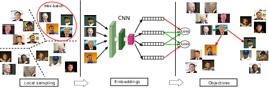
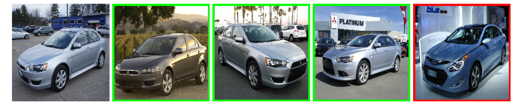

# Improving Deep Metric Learning with Local Sampling
An implementation of the stochastic symmetric triplet (SST) loss. For any question, please contact Bac Nguyen (nguyencongbacbk@gmail.com).

## Abstract
Designing more powerful feature representations has motivated the development of deep metric learning algorithms over the last few years. The idea is to transform data into a representation space where some prior similarity relationships of examples are preserved, e.g.,\ distances between similar examples are smaller than those between dissimilar examples. While such algorithms have produced some impressive results, they often suffer from difficulties in training. In this paper, we propose a simple sampling strategy, which focuses on maintaining locally the similarity relationships of examples in their neighborhoods. This technique aims to reduce the local overlap between different classes in different parts of the embedded space. Additionally, we introduce an improved triplet-based loss for deep metric learning. Experimental results on three standard benchmark data sets confirm that our method provides more accurate and faster training than other state-of-the-art methods.

## Proposed Method

  
<em> An overview of the proposed method. First, images from a neighborhood are sampled. Then, a convolutional neural network (CNN) is used to map images into the embedded space. A loss function is employed to push similar images close to each other, while keeping dissimilar images far apart. Finally, the similarity relationships are satisfied on all neighborhoods. </em>

 

<em>
An illustration of the negative gradients induced by (a) the triplet loss and (b) the SST loss
</em>

## Results

<em>
Top-4 retrieval images for random queries on the CUB-200-2011 (top), CARS169 (middle), and Stanford Online Products (bottom) data sets. Correct matches are marked with green color and incorrect matches are marked with red color.
</em>

